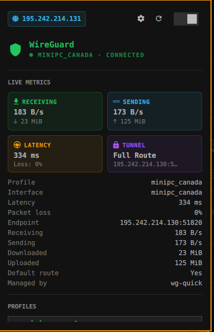
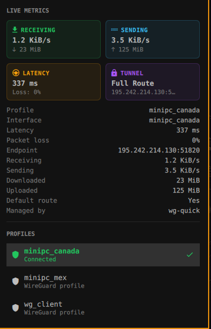

# WireGuard VPN Plugin for Omarchy (`yeleticc.vpn`)

A modern, native WireGuard VPN widget and management panel for the **Omarchy Desktop Shell**.


<p align="center">
  
  &nbsp;&nbsp;
  
</p>

---

## Features

- **⚡ Fast Tunnel Switching**: Seamlessly connect, disconnect, and switch between WireGuard profiles (`*.conf`) located in `~/.config/omarchy/vpn/profiles/`.
- **🌐 Dynamic Public IP & Geolocation**:
  - Displays exit IP address, **Country Flag Emoji** (e.g. 🇨🇦, 🇺🇸, 🇩🇪), City, and ISP / Network provider.
  - One-click copy to clipboard (`wl-copy`) with instant feedback.
  - Automatically updates on profile connect, switch, or disconnect.
- **📊 2×2 Live Metric Cards**:
  - **RECEIVING**: Real-time incoming throughput (`KiB/s`, `MiB/s`) and session totals.
  - **SENDING**: Real-time outgoing throughput and session totals.
  - **LATENCY**: Polled round-trip ping time (`ms`) and packet loss percentage.
  - **TUNNEL HEALTH**: Default route validation (`0.0.0.0/0`), location, and endpoint address.
- **🔔 Native Omarchy Notifications**: Instant desktop notifications powered by `omarchy-notification-send` with active theme styling, Nerd Font glyphs, and click-to-open interaction.
- **🚀 Zero-Fork Telemetry**: Pure Bash built-in stream processing eliminating 90% of subprocess forks for ultra-lightweight CPU footprint.
- **🎨 Omarchy Theme Integration**: Seamlessly follows the active Omarchy theme colors, typography, and borders with zero hardcoded styling.
- **📂 Empty State Handling**: Prompts with an interactive `"Open Profiles Directory"` button when no configurations exist.
- **⌨️ Keyboard Accessible**: Full vim-style navigation (`j`/`k`, `h`/`l`, `/`, `d`, `r`, `Enter`, `Esc`).
- **🤖 IPC CLI Control**: Full command-line and keybinding integration via `omarchy-shell`.

---

## Requirements

Ensure `wireguard-tools` and `curl` are installed on your system:

```bash
# Arch Linux / Omarchy
sudo pacman -S wireguard-tools curl
```

---

## Installation

### Via Omarchy Marketplace
1. Open the Omarchy Menu ➔ **Setup** ➔ **Plugins**.
2. Search for **VPN** (`yeleticc.vpn`) and click **Enable**.

### Manual Installation
Clone this repository directly into your Omarchy plugins directory:

```bash
git clone https://github.com/chaitanyayeleti/yeleticc.vpn.git ~/.config/omarchy/plugins/yeleticc.vpn
omarchy-shell shell rescanPlugins
```

Add `"yeleticc.vpn"` to your `~/.config/omarchy/shell.json` in the `bar.layout.right` section:

```json
{
  "id": "yeleticc.vpn"
}
```

---

## Profiles Setup

Place your WireGuard configuration files (`*.conf`) into:
```bash
~/.config/omarchy/vpn/profiles/
```

Example (`minipc_canada.conf`):
```ini
[Interface]
PrivateKey = <YourPrivateKey>
Address = 10.0.0.2/24
DNS = 1.1.1.1

[Peer]
PublicKey = <ServerPublicKey>
Endpoint = 195.242.214.130:51820
AllowedIPs = 0.0.0.0/0
```

---

## Keyboard Shortcuts

When the panel is open:

| Key | Action |
| :--- | :--- |
| `j` / `↓` | Move down through profiles and buttons |
| `k` / `↑` | Move up through profiles and buttons |
| `h` / `l` | Step between sections / chips |
| `/` | Focus instant profile search filter |
| `d` / `D` | Disconnect active tunnel |
| `r` / `R` | Force refresh and re-detect |
| `Enter` / `Space` | Activate selected profile or action |
| `Esc` | Close panel |

---

## IPC Commands

You can interact with the plugin directly from the terminal or keybindings using `omarchy-shell`:

| Command | Action |
| :--- | :--- |
| `omarchy-shell yeleticc.vpn status` | Print current connection status |
| `omarchy-shell yeleticc.vpn ip` | Print current public IP |
| `omarchy-shell yeleticc.vpn toggle` | Toggle active connection |
| `omarchy-shell yeleticc.vpn connect <profile>` | Connect to a specific profile |
| `omarchy-shell yeleticc.vpn disconnect` | Disconnect active tunnel |
| `omarchy-shell yeleticc.vpn open` | Open the VPN panel |
| `omarchy-shell yeleticc.vpn refresh` | Force a refresh cycle |

---

## License

MIT License © 2026 [yeleticc](https://github.com/chaitanyayeleti)
